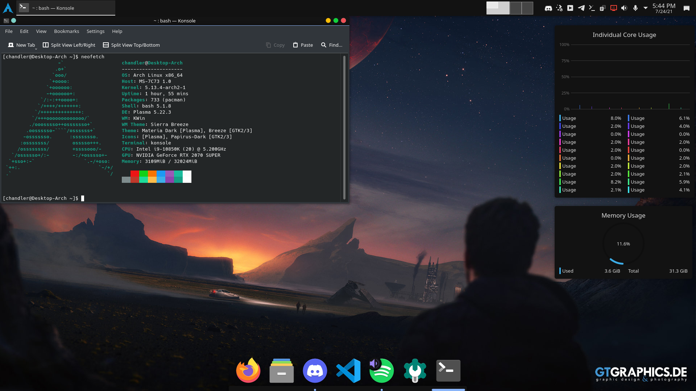

## Intro

This is not a guide on how to install Arch. If you want a guide, use the [official Arch Guide](https://wiki.archlinux.org/title/Installation_guide). I will say that the official Arch guide completely glosses over multiple things that I would argue are essential to the basic function of your Linux system, which is why I wrote this. 

This is a guide on how to fix those pesky problems while installing Arch and will help you both understand how Linux works under the hood and get your Arch installation working smoothly.

## Hardware

It is very important to know the hardware that you are installing Arch Linux to. If you are installing to a Virtual Machine just to try it out this is less important, but otherwise you have to make sure the correct drivers (as well as the programs to control said drivers) are installed while you have the installation media, as Arch assumes you know what you're doing and will not install the drivers and programs otherwise. This is something you'll have to research for your hardware.

## Programs

As previously stated **assume nothing that you need is installed**. This includes some *really* basic stuff, such as [`sudo`](https://wiki.archlinux.org/title/Sudo), text editors like [`nano`](https://wiki.archlinux.org/title/Nano) and [`vim`](https://wiki.archlinux.org/title/Vim) and a [DHCP Client](https://wiki.archlinux.org/title/Network_configuration#DHCP). Now whether you need `sudo` can be up for debate, however most people are going to want it so they don't have to use root all the time. The DHCP Client, usually `dhcpcd`, is also something that most users will want unless Arch is getting a static IP. 

A browser also isn't included, so either `firefox` or `chromium` is going to want to be included in the installation. If you want to get up and running fast, you *can* add all the programs you'll need while you are bootstrapping the OS (what `pacstrap` does), but its not recommended. Usually I get the OS booted and connected to the internet without the installer then install the recommended packages, but you can install some programs and a desktop environment quickly otherwise. 

[Here](https://gist.github.com/chand1012/8658d07bd6dddf0a8c561059eed45d4f) is a list of packages that I have installed on my Arch system. I'm running KDE Plasma with the Materia Dark theme and Papirus Icons.

And here is what it looks like.

