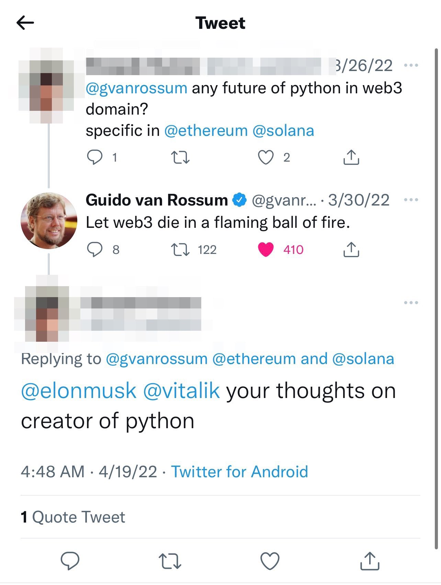

# Preamble

For clarification: I use "crypto" and "web3" interchangeably. Technically they are not the same thing, but in the current state they are so tightly tied together they may as well be the same thing. 

Disclaimer: I currently work for a Web3 company.

# Intro

Web3 is a controversial topic. I have friends and colleagues on both sides of the Web3 argument. Recently, a colleague of mine sent this tweet from Guido van Rossum, the original creator of Python.

Was this statement a little extreme? Probably. Is this a new option? Definitely not.

I'm not going to deny that Web3 and Blockchain technology has issues. Lots of them in fact! Lets start with me complaining about my most disliked of the issues with Web3. After I'm done complaining, I'll discuss currently proposed solutions to all these problems.

# Common Concerns

## Proof of Work

The first issue that environmental advocates and gamers alike like to bring up is an issue entirely exclusive to proof-of-work blockchains. That issue is the mass purchase and use of power-hungry of GPUs, as well as the manufacturing of dedicated mining hardware, called ASICs. Proof-of-work is a blockchain consensus mechanism that uses GPUs and ASICs to processes transactions en mass, and it makes proof-of-work chains slow, inefficient, and power hungry. GPUs and ASICs burn hundreds of watts of power each, and are usually kept in farms number in the dozens or hundreds. This means that they can use megawatts of power, and cause the burning of tons of fossil fuels since their inception, especially in countries like the United States, Russia, and China, where coal and natural gas power are the primary ways power is generated. This means that PoW chains are the *least* environmentally friendly way to host a blockchain. 

## Speed

Current consensus mechanisms used on Ethereum and Bitcoin are slow. When the network is at a high load, it can take minutes for a transaction to go through, which can feel like forever in the age of instant gratification. 

## Uses for the Blockchain

Some people argue that the blockchain is a pretty useless piece of technology. Common examples cited tends to be things like NFTs and shitcoins with no use other than making the initial creators lots of money. Even Mr. Ethereum himself, [Vitalik Buterin](https://twitter.com/VitalikButerin), said that the use of NFTs as ways to flaunt wealth is concerning and [compared it to gambling millions](https://markets.businessinsider.com/news/currencies/ethereum-vitalik-buterin-crypto-bored-ape-yacht-club-nft-wealth-2022-3). 

As of today, I think the use case for NFTs is hollow at best. Could they be used as a way to display ownership of goods in a meaningful way in the future? Absolutely! Do they have functionality in such a way where people today would care? Absolutely not! 

## Lack of accountability

Many people have concerns with criminals, hacker groups, and even [entire nations](https://www.barrons.com/advisor/articles/senator-elizabeth-warren-bill-cryptocurrency-russia-51647635877) using crypto to evade the law. All transactions on the blockchain have no identity attached to them, just the addresses of the sender and recipient. This means that many governments are concerned about tax evasion, black market sales, and other criminal activity being facilitated via the blockchain. Hacker groups are especially prophetic about using crypto in their illicit activities, usually using crypto as their payment for ransoms. The United States put a law in place requiring all crypto exchange sites to take take the information of their customers operating in US, and requiring them to give out tax information so that crypto transactions can be accounted for like a traditional stock market security. Crypto and web3 is decentralized by nature, allowing anyone and everyone to use it for whatever purpose they see fit, and some see this as a big downside.

# Modern Problems Require Modern Solutions

Nearly all of these concerns have solutions that are either currently being worked on, or are already solved.

## Goodbye Proof Of Work, Hello Proof of Stake

The current power hungry system being utilized by Ethereum is being done away with by the end of this year, being replaced with a system called Proof Of Stake. This requires people to have "stake", or tokens already on the network, to create a node. Nodes are no longer GPU and ASIC based, and are instead designed to be simple CPU nodes, being light enough to run on the 10W single-board Raspberry Pi computer. Many other blockchains, such as NEAR and Avalanche, never used Proof-of-Work, and are instead designed to use as little power as possible while still upholding a global network. 

Proof of work is a competitive protocol by nature. Nodes compete to finish the transaction first, and the node that completes it gets the reward in coins. 

Proof of stake randomized the distribution of this transaction, one node is the node that actually processes the transaction. Then all the other nodes check the hash to make sure that the transaction went through successfully and vote on if it gets added to the chain. Once a consensus is met, the transaction gets added to the chain. This makes the proof of stake much less power hungry, and distributes load of the network evenly to all nodes, theoretically improving speed as well.

## Layering The Speed

On Ethereum, there exists this concept of a Layer 2 network. This is a network that compresses transactions, speeding up the network while also keeping the cost of "gas", or the fee you pay the network, as low as possible. These layer 2 networks have a number of methods to distribute load and make the network faster, but all the average developer or consumer needs to know is that it makes it faster and cheaper for everyone!

On other blockchains, speed is something that was a concern when developing the chain. Avalanche actually designed 3 separate chains to keep the network load spread out and NEAR is designed with horizontal scaling in mind, "sharding" the load to many nodes at once.

## A World Computer

What if you could write code that doesn't just run on one computer, but runs on the entire internet? What if you could write an application that never goes down, never stops working? This is the concept of a smart contract, or backend code that runs on the blockchain. These contracts run when certain conditions are met, which is usually as simple as just requesting the contract runs. This distributed method of computing improves uptime for applications designed with the blockchain and web3 in mind, commonly called DApps (literally Decentralized Apps). Currently, the frontend code has to be hosted on a traditional web server, but that is quickly changing with the development of decentralized file distribution platforms such as [IPFS](https://ipfs.io/) and [Filecoin](https://filecoin.io/). 

Let me paint you a picture. Imagine a world where there are no data centers, and "the web" is truly a web. Rather than all web traffic going through an AWS, Azure, or GCP data center, it goes directly to the source of the content. Rather than having to go halfway around the world to see the funny video that some guy in Japan posted, the file could be distributed by people who had viewed the video in your country. The content could have a caching system where once the content hasn't been accessed in a while, it gets removed from the near by caches, but its distributed in such a way where your devices will always go to the closest source of the content, even if the closest source is the original creator.

## Freedom and Privacy

Now that I've got off my 90's internet pipe dream soapbox, let me jump on another one. 

While Twitter and Facebook aren't known for censoring people left and right unless their believes are quite radical or causing dissonance, there are places today where this isn't the case. There are countries where censorship is a big issue. If you say something that a government of one of these countries even slightly disagrees with, you will at the very least have your post removed, and you could have worse consequences as well. 

Web3 offers a way to democratize and make the internet more private. By using only wallet addresses and screen names as identities, you can evade censorship of autocratic and censoring governments, as well as keeping a low public profile.

Now this wouldn't mean that the Web3 internet would be an ungovernable wild west. Web3 encourages democracy, allowing people to vote on membership of groups or sites. Could you just assume a new identity and continue attempting your reign of misinformation and terror? Sure. Would the web3 community just vote you off the web again? Yes they would.

Would any of this stop illicit transactions and criminal use of the blockchain? Not necessarily. However, fraudulent and criminal transactions is a problem with both physical currency as well as things like wire transfers (as [Linus found out](https://youtu.be/ITCohgBLLJM)). Using the blockchain isn't going to change this in any way, and criminals will find a way to do crime and get paid for it regardless of if we use physical money, centralized banks, or the blockchain.

# Summary

Web3 is not in a state where it could be used in the mainstream. However, I believe in its future and I intend to be a pioneer in the industry, paving the way for a decentralized, democratized, and private internet future.