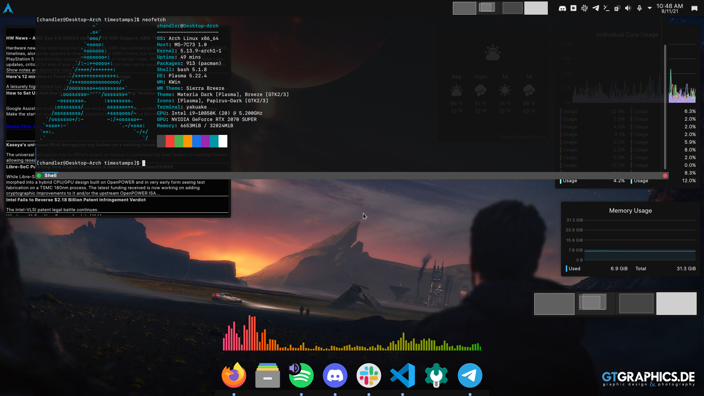

## Intro

This is not a guide on how to install Arch. If you want a guide, use the [official Arch Guide](https://wiki.archlinux.org/title/Installation_guide). I will say that the official Arch guide completely glosses over multiple things that I would argue are essential to the basic function of your Linux system, which is why I wrote this.

This is a guide on how to fix those pesky problems while installing Arch and will help you both understand how Linux works under the hood and get your Arch installation working smoothly.

## Hardware

It is very important to know the hardware that you are installing Arch Linux to. If you are installing to a Virtual Machine just to try it out this is less important, but otherwise you have to make sure the correct drivers (as well as the programs to control said drivers) are installed while you have the installation media, as Arch assumes you know what you're doing and will not install the drivers and programs otherwise. This is something you'll have to research for your hardware.

## Programs

### Required Programs

As previously stated **assume nothing that you need is installed**. This includes some _really_ basic stuff, such as [`sudo`](https://wiki.archlinux.org/title/Sudo), text editors like [`nano`](https://wiki.archlinux.org/title/Nano) and [`vim`](https://wiki.archlinux.org/title/Vim), and a [DHCP Client](https://wiki.archlinux.org/title/Network_configuration#DHCP). Now whether you need `sudo` can be up for debate, however most people are going to want it so they don't have to use root all the time. The DHCP Client, usually `dhcpcd`, is also something that most users will want unless Arch is getting a static IP.

If you want to get up and running fast, you _can_ add all the programs you'll need while you are bootstrapping the OS (what `pacstrap` does), but its not recommended. Usually I get the OS booted and connected to the internet without the a desktop then install the recommended packages, but you can install some programs and a desktop environment quickly otherwise.

[Here](https://gist.github.com/chand1012/8658d07bd6dddf0a8c561059eed45d4f) is a list of packages that I have installed on my Arch system.

### Desktop

The guide also completely skips over the fact that you don't get a functioning desktop environment with Arch, nor do you get a display server to run it. You will have to install your respective video driver, as well as a display server, before you can set up a Display Manager and Desktop Environment. The driver will differ depending on your system, but all systems will need a Display Manager and a Desktop Environment (unless you're running an Arch server). The [Display Manager](https://wiki.archlinux.org/title/Display_manager) manages your selected desktop, as well as your user login. I use `sddm` as my Display Manager. Your Desktop Environment is what manages your desktop and programs. I as previously stated, I prefer KDE Plasma, but you should investigate your options and see which one looks the nicest to you. [Here](https://wiki.archlinux.org/title/Desktop_environment) is the Arch Linux wiki page on Desktop Environments. You will need a [graphics driver](https://wiki.archlinux.org/title/Category:Graphics) first, but the display server should install when you install the desktop environment.

I'm running KDE Plasma with the Materia Dark theme, Papirus Icons, and Sierra Breeze Dark window decorations. More information can be found [here](https://www.reddit.com/r/unixporn/comments/p2eo9a/kde_plasma_i_like_my_widgets/). Here's what it looks like.



### Bootloader

The article in question doesn't include anything but a link to the bootloader page of the Arch Wiki, and again assumes you'll know what you're doing. If you don't know what you're doing, GRUB is probably going to be what you want to use. Its the most common as well as the simplest to install. The [GRUB page](https://wiki.archlinux.org/title/GRUB) should give you enough information on how to install the program, but don't forget to generated the [main GRUB config](https://wiki.archlinux.org/title/GRUB#Generate_the_main_configuration_file).

GRUB also has support for dual booting, and if you install the `os-prober` and `ntfs-3g` programs before running the main config generator, as well as add the following line to the end of `/etc/default/grub` you can dual boot with Windows (or another Linux install) automatically.

```
GRUB_DISABLE_OS_PROBER=false
```

If you followed the GRUB instructions and your system still won't boot, try re-running the `grub-install` command with the `--removable` flag. This can sometimes fix issues with your UEFI BIOS not wanting to boot when this flag is omitted.

### Optional, but Recommended

A browser isn't included, so either `firefox` or `chromium` is going to want to be included in the installation if you want to access the internet.

One program I recommend all Arch users to run, though especially beginner users, is `yay`. This is a AUR helper, which will aid in searching, downloading, and installing of packages from the Arch User Repository. It also can install packages from the official repositories via `pacman`. [Here](https://github.com/Jguer/yay#installation) is a link to its install guide.

## If you're dual booting with Windows

I recommend switching Windows to use UTC instead of your respective timezone for the Hardware clock. This ensures that Windows' time doesn't get screwed up when you switch between the two. [Here](https://feldspaten.org/2019/11/03/windows-10-clock-in-utc/) is a guide on how to do that.

## Why don't we just install Manjaro or Pop OS?

If you are asking this question, you shouldn't be using Arch.

If you've never installed a Linux system before, this may seem like a lot, but this is very normal for a Linux install. The reasons operating systems are so big is because of pre installed programs, but with Arch, this isn't a problem. A full Arch install, with a lightweight desktop and basic internet browser, is around 2GB, compared to Ubuntu Desktop's 8GB or to Windows' 10GB. After you install a desktop and other packages required to use Arch in a productive setting, it will still only be between 3 and 4GB, depending on your chosen Desktop.

When I first boot, no programs start, and I use about 1GB of RAM. Compare this with my quite heavy Windows partition, where up to 10GB can be used at idle (this is mostly because Docker runs at startup and that uses a VM on Windows 10 WSL2).

That's why I wanted to try out Arch - I wanted a super customizable system with everything I needed and not a drop more. Ubuntu, Manjaro, and many other systems include many applications I do not need, and some may include applications I don't trust either. Using Arch solidifies my privacy as well as giving me total control over the Linux system. It can also teach someone who doesn't know a lot about how Linux works very quickly.

## Conclusion

I do not recommend Arch for beginner's diving into Linux. However, if you have a little bit of Linux experience under your belt already, it can be a very rewarding an educational experience, both teaching you about how Linux works as a connected system of many programs and giving you a satisfying workstation that you build up yourself.
