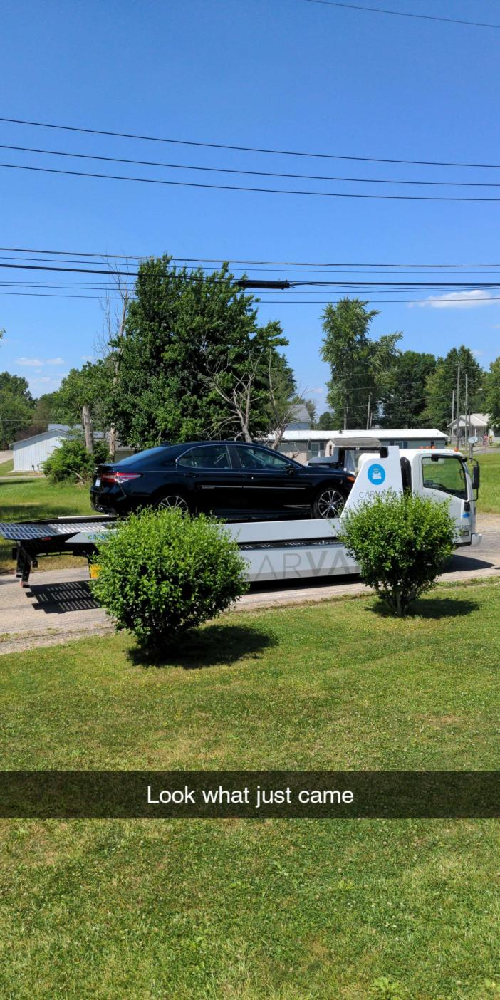
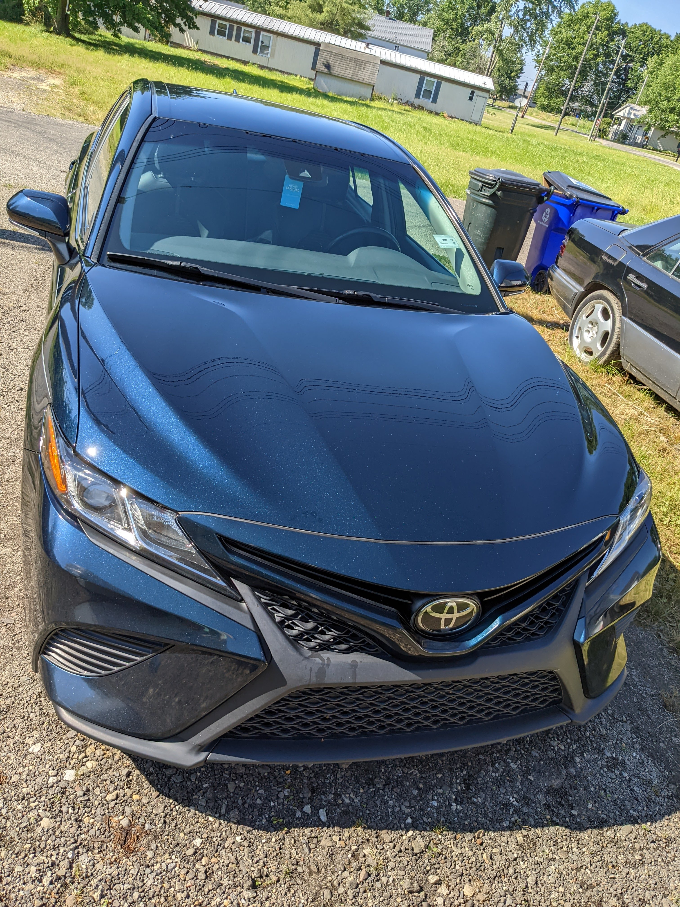

+++
title = "Buying a Car on Carvana"
date = "2022-07-07T08:41:10-04:00"
author = ""
authorTwitter = "" #do not include @
cover = ""
tags = ["cars", "review", "shopping"]
keywords = ["carvana", "car", "shopping"]
description = "Carvana makes it seem like a breeze. Is it really that easy?"
showFullContent = false
readingTime = false
hideComments = false
draft = true
+++

# Why? 

First of all, my rusty 2012 Ford Escape with 193k miles on it is getting a little hard to maintain. Every couple of weeks I have to fix something, and it just cost me $500 to fix one thing, then not even a month later something else breaks that's gonna cost me $300 to fix and so on. I figured at this rate I could just buy a new car with less problems and more modern features.

I've been looking at getting a new car for *months*.
I've been looking at every website, every model, every dealership, everything. 
My specific set of requirements were this: it had to be fuel-efficient, it had to have modern driver assist features (lane keep assist and radar based cruise control being my big two), and had to be able to play bluetooth music, which is pretty standard, with Android Auto being preferred.

My friends are all really into EVs, and I think the idea of them is really cool. However, while I really like the *idea* of an electric car, my current living situation would make one impractical at best, and nearly impossible at worst. The nearest EV chargers are 20 minutes away, and installing a fast charger at a house I don't own is probably not going to be an option.

I also looked into hybrids, and while that would be preferred, the current state of gas prices means that hybrids, both new and used, are actually hard to come by, so I decided that the car being a hybrid would be a nice-to-have.

I didn't really care about the brand, only about the potential reliability implications. I looked at all of the brands that still make sedans and hatchbacks, as I'm not one for brand loyalty. Here is the list of potential cars I had.

* Kia K5
* Toyota Corolla Hatchback
* Toyota Camry (and Camry Hybrid)
* Honda Civic
* Honda Insight (basically just a Civic Hybrid)
* Honda Accord (and Accord Hybrid)

At first, I wanted a new one. Like, **brand new**. I figured that in the current used car market it was probably going to be impossible to find any of these vehicles for much less than their new price, and even then a new car usually has a warranty and zero miles so its probably worth the extra cost. Boy was I wrong.

Most dealerships around me hide their prices on their sites, and if they don't, they're very honest about mark-up. I made the mistake of making an appointment to look at a new Kia K5 at a nearby dealership only to find out the one I wanted was marked up by **$5000**. I'm not paying nearly $40k after tax, title, and fees for a car that's worth $30k at most. 

So then I thought I'd give a look at the used car market again after being disappointed by the state of the car market. The dealerships' prices were *awful*, charging you MSRP for some of the used vehicles in some areas. Around where I live, its not *that* bad, but many people are definitely paying new car prices for something that's the better part of 5 to 10 years old. 

# Finally. Carvana.

I was browsing Carvana on the night my SUV last broke. I was pissed because I had just spent a lot of money getting it fixed, and now it was un-drivable again. My search criteria was that it had to get a combined fuel efficiency rating of at least 30MPG, it had to have less than 70k miles, and it had to be a 2018 model or newer. At first I was quite disappointed. All the cars I found were within spitting distance of MSRP when they were new, though not like it matters because good luck finding at any new car at those prices. I just kept scrolling. Some of the deals weren't bad, being about $10k below MSRP for a car with a good reliability rating but slightly high miles. I had found three cars I liked so far: a white 2018 Accord Sport, a grey 2019 Civic Sport, and a grey 2019 Camry SE. I added them to my wishlist. I scrolled for one more page, then I found it. I found the car I wanted to (try) to purchase. It was another 2019 Camry SE, with the same amount of miles as the first one. But it was blue with metal flakes. And it was $2000 cheaper.

I really couldn't tell why the blue one was cheaper. They had the same feature set, but the blue one had more miles. I guess maybe blue was a less desirable color? I'm not sure. Decided that if the blue one was available after class tomorrow, I'd buy it.

Sure enough, when I got home from class, the car was still available. So I got to work.

# Was it really *that* easy?

Carvana has some **aggressive** marketing on TV here in the US. There are very few TV channels you can watch without seeing an ad for them (and maybe Vroom). They make it sound like you can buy a car as if it was Amazon with two day shipping. News flash for anyone who's new to car buying: its not that simple.

First you have to get approved for financing. Its not hard, you just need to put in a lot of personal information that the banks use to track how much money they can make off of y--, I mean track your credit score. After that's done you can set your down payment, get your monthly payment, and get set up to buy the car. It only took me about 30 minutes to actually get all the information I needed in order to finish buying the car. 

# Now we wait.

When I first bought the car Carvana told me I could have it by Monday after I bought it. I actually went ahead and bought the car on Thursday, and while they deliver on weekends, it wasn't available. So I chose Monday at 3PM. So I was quite disappointed when on Monday I got an email telling me my delivery was delayed until Thursday at 3PM. It was no big deal, but boy was I upset. 

To receive your car, you have to do some paperwork. You have to sign their agreements, your purchase contract, among other things. I did all this before I got the car because I was extremely excited to get a new car.

# It arrives.

Now because this was *the largest purchase of my life* I was extremely excited and wasn't paying attention to the gritty details of the car. It came just like in the commercials, on a white flatbed truck.

The driver handed me the keys and allowed me to take the car around the block before finalizing the the paperwork. I *loved* how this car rode and drove, but we'll get to that later. I came home and filled out the little bit of paperwork, as well as providing him with proof of insurance as well as a picture of myself with my driver's license. 

He mentioned I have 7 days to decide on if I'm keeping the car, if not I give it back with no questions asked. After that he said, "you're all set!" and drove off. 

# The car itself.

I knew after only 2 days I was keeping it. While it has 67k miles, *its a Toyota*.

The driving experience is *much* better than my SUV. It rides very similar to my mother's Lexus, it handles corners well, and the steering feels tight. Its not a fast car, but its fast enough for my uses. The fuel milage is on-par or *better* than what Toyota advertises. On my way from my house to a friend's house it averaged 42 MPG, Toyota only claims 39. 

## It isn't perfect.

The interior has some wear and stains, but nothing a good detailing won't fix. Now there was some damage on the vehicle that Carvana did not mention, and I assume was overlooked. The vehicle had some scratches on the bottom of the bumper where it looks like someone may have curbed the vehicle, as well as a hanging trip piece on the driver's side, with that same trim piece missing entirely from the passenger side.

# Registration.

Now this is where Carvana needs to update their site with more information on. There was no information about registration on their site and I had to wait until they emailed me about it. I opted to have my plates transferred rather than get new ones since I'm not a fan of my state's new plates. There was delay after delay, and I ended up getting my registration only days before my temporary tags expired. Apparently this is a common issue, and during the pandemic there were reports that people may have owned their cars for [well over a year](https://www.autoblog.com/2021/11/29/carvana-complaints-registration/) before Carvana would send them their registration. Luckily I got mine just in time.

# Conclusion

Carvana was a convenient way to buy a car, but they definitely have some kinks to work out. If you find a car that you really like on Carvana I say give it a shot, but its definitely not replacing a dealer anytime soon.
