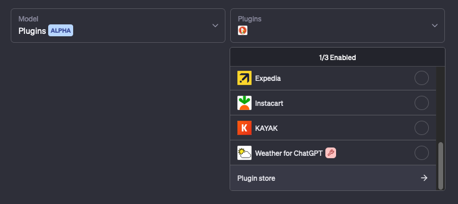
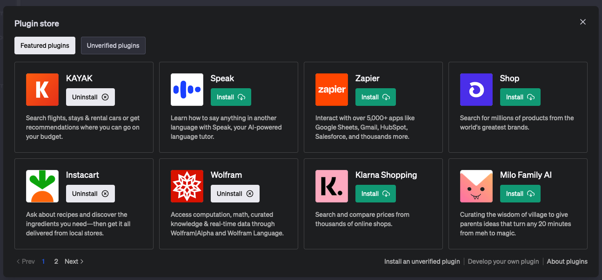
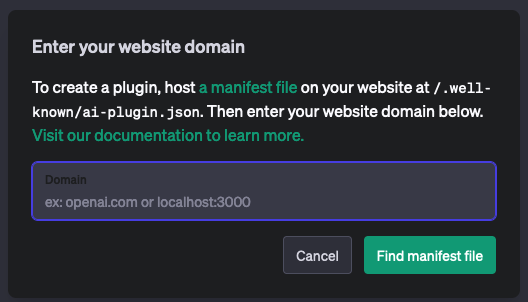

OpenAI's ChatGPT has revolutionized the way we interact with AI models, providing users with impressive language generation capabilities. To further enhance ChatGPT's functionality, OpenAI has introduced ChatGPT Plugins, which are currently in closed alpha and may not be accessible to everyone. If you're interested in gaining access, you can join the waitlist [here](https://openai.com/waitlist/plugins). ChatGPT Plugins enable users to connect ChatGPT with third-party applications and APIs, extending its capabilities beyond the core model. 

## What are ChatGPT Plugins?

ChatGPT Plugins enable users to connect ChatGPT with third-party applications and APIs, extending its capabilities beyond the core model. With plugins, ChatGPT can perform a wide range of actions, such as:

1. Retrieve real-time information (e.g., sports scores, stock prices, latest news)
2. Access knowledge-base information (e.g., company docs, personal notes)
3. Perform actions on behalf of users (e.g., booking a flight, ordering food)

## Creating a ChatGPT Plugin

There are three main components required to create a ChatGPT plugin:

1. API
2. Manifest file (ai-plugin.json)
3. OpenAPI specification

How a ChatGPT plugin works is that after you ask ChatGPT a question, it determines if it should use the API. If it thinks the API would be helpful, it gets the OpenAPI specifications and uses them to make a request to the API. It then parses the response and continues as normal, making subsequent requests as it deems necessary. It can even mix and match requests to multiple APIs in a single response!

## Getting Started

Rather than starting from scratch, we'll guide you through the process of creating a ChatGPT plugin using a Python and FastAPI template, which allows for rapid development and ease of use. The template repository can be found at [https://github.com/TimeSurgeLabs/weather-chatgpt](https://github.com/TimeSurgeLabs/weather-chatgpt).

Disclaimer: Its my plugin template that I’ve used to develop my plugin prototypes.

## Prerequisites

Before you begin, make sure you have the following installed on your system:

* [Python 3.11](https://www.python.org/downloads/)
* [pipenv](https://pipenv.pypa.io/en/latest/)
* [just](https://just.systems/man/en/chapter_5.html)
* [Git](https://git-scm.com/downloads)

To install pipenv, use pip:

```bash
pip install pipenv
```

## Create a New Repository from the Template

To create a new repository from the template, use GitHub's UI:

* Visit the [template repository](https://github.com/TimeSurgeLabs/weather-chatgpt).
* Click the "Use this template" button.
* Follow the instructions to create a new repository based on the template.

## Clone the Template Repository

Clone your new repository, which is based on the template:

```bash
git clone <https://github.com/your_username/your_repository.git>

```

## Install Dependencies

Once you have cloned the repository, install the necessary dependencies.

```bash
cd your_repository
pipenv install
```

## Start the Development Environment

Activate the shell using `pipenv shell` and start the development server using the Justfile task: `just dev` .

## Customizing the Template

With the template set up, you can now customize it for your specific plugin use case. Make sure to update the following files:

* `ai-plugin.json`: Update the name and description fields to provide more context about your plugin for both ChatGPT and potential users.
* `Pipfile`: Update the dependencies required for your plugin.
* `main.py`: Modify the FastAPI application entry point to implement your plugin's functionality.

During development, you can use the Justfile tasks to build, run, and test your plugin. The `just dev` task will start the development server, which automatically reloads when you make changes to your code. The `just build` task will build a Docker image for your plugin. The `just run` task will run your plugin in a Docker container. Make sure to update the Justfile with the correct image name and tag.

## Connecting Your Plugin to ChatGPT

To connect your plugin to ChatGPT, follow these steps:

1. Ensure the `ai-plugin.json` file is hosted on your API's domain (e.g., `https://example.com/.well-known/ai-plugin.json`).
2. Run your plugin either locally (for development purposes) or on a remote server.
3. Navigate to the “Plugin Store”, and click “Develop your own plugin”.
4. Enter your base plugin URL. For development, this will be `http://localhost:8000`.
5. Install and test your plugin in ChatGPT.

Here are some related screenshots.



Plugin Store Button



Plugin Store Popup



Developer URL Modal

## Conclusion

By using the Python and FastAPI template repository, you can quickly create and customize ChatGPT plugins to suit your needs.

OpenAI's ChatGPT has revolutionized the way we interact with AI models, providing users with impressive language generation capabilities. To further enhance ChatGPT's functionality, OpenAI has introduced ChatGPT Plugins, which are currently in closed alpha and may not be accessible to everyone. If you're interested in gaining access, you can join the waitlist [here](https://openai.com/waitlist/plugins). ChatGPT Plugins enable users to connect ChatGPT with third-party applications and APIs, extending its capabilities beyond the core model. In this blog post, we'll walk you through the process of creating a ChatGPT plugin, from setting up the API and manifest file to running and testing the plugin, assuming you have access to the closed alpha.
