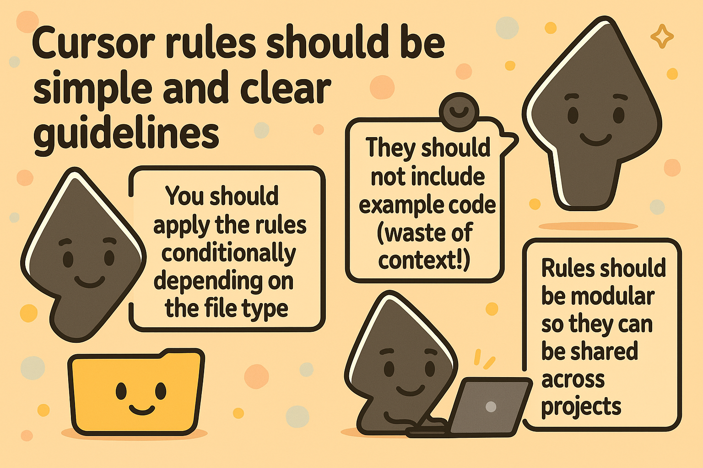
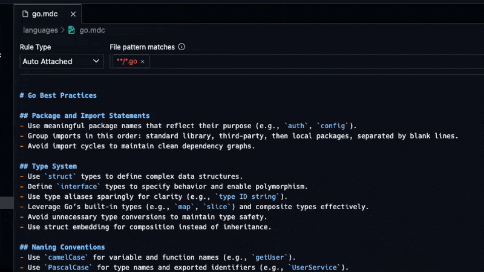
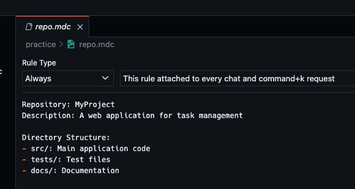
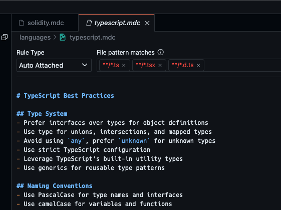
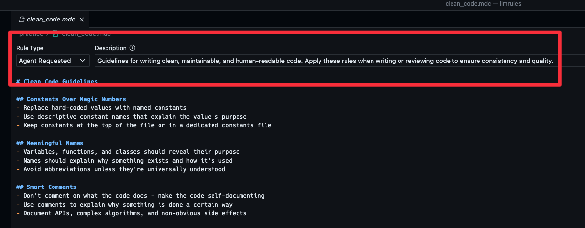
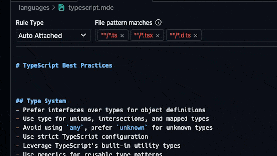
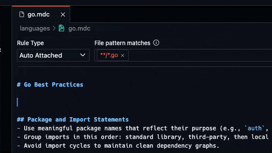

+++
title = "Agentic Coding (Vibe Coding) Best Practices"
date = "2025-03-25T15:24:15-04:00"
author = "Chandler"
authorTwitter = "@Chand1012Dev"
cover = "cover.png"
tags = ["ai", "development", "coding"]
keywords = ["Vibe Coding", "Programming", "Software Development", "AI", "Agentic Coding", "Agentic Programming", "Cursor"]
description = "Whether you call it agentic coding, vibe coding, or something else, it's a real thing. Here are some best practices for using it."
showFullContent = false
readingTime = false
hideComments = false
draft = false
+++

## TLDR



If you've been living under a rock, you may not be aware of the "vibe coding" phenomenon.
If you want a good explanation of what "vibe coding", or to use a more technical term, Agentic Coding, is, check out [Fireship's video](https://youtu.be/Tw18-4U7mts?si=wmgKylbi-gEEmXzU) on the subject. He does a great job of explaining the concept in a way that's both easy to understand and objective about the pros and cons.

## Tooling

If you're going to ignore all the cons and go ahead with agentic coding, there are some best practices I use to make sure my code doesn't turn into a complete mess of AI generated garbage. I personally use Cursor, so this guide is going to use their [Rules feature](https://docs.cursor.com/context/rules-for-ai) to organize and apply rules to the LLM for code generation. I'll also include some documentation for using [OpenHands](https://docs.all-hands.dev/), a similar open source tool for a slightly different approach.

## Rules

Cursor has a concept of a rule file. This file is a markdown file found in the `.cursor/rules` directory with some extra front matter that specifies when and how the rule is applied to the LLM, and ending in `.mdc` rather than `.md`. These can be broken down into 4 categories.

- Language Rules
  - Applies to specific languages.
- Framework Rules
  - Applies to specific frameworks.
  - Can also apply to libraries that have special rules, like shadcn/ui.
- Practice Rules
  - For coding practice guidelines.
- Project Rules
  - Should be used to describe project specific guidelines like file structure, dependencies used, etc.

Rules can be applied with 4 different methods.

- Always Apply
- Auto Apply
  - Uses a glob pattern to apply the rule to all files that match the pattern.
  - Especially useful for language and framework rules where specific file extensions are used.
- Agent Requested
  - Uses a description of the rule to allow the agent to decide when to apply the rule.
- Manual Apply
  - Only applied when you directly ask the agent to apply the rule.

Rules can also have other files from within your project linked to them and will also be loaded into context. This is especially useful for the project rules where you can link the README as well as any other documentation that the LLM should know about, like an Architecture or Contributing Guide.

## Writing Rules

The actual contents of the rules are written in markdown, and should be concise and clear guidelines for the LLM rules. They should be written to be both human and LLM readable, and should include very minimal code and command examples. Here's some examples of rules from my [personal collection](https://github.com/chand1012/cursorrules).

## Example Rules

Here's an example I made for best practices when using Go.

```markdown
---
description: Go coding standards and best practices for modern development
globs: **/*.go
---

# Go Best Practices

## Package and Import Statements
- Use meaningful package names that reflect their purpose (e.g., `auth`, `config`).
- Group imports in this order: standard library, third-party, then local packages, separated by blank lines.
- Avoid import cycles to maintain clean dependency graphs.

## Type System
- Use `struct` types to define complex data structures.
- Define `interface` types to specify behavior and enable polymorphism.
- Use type aliases sparingly for clarity (e.g., `type ID string`).
- Leverage Go’s built-in types (e.g., `map`, `slice`) and composite types effectively.
- Avoid unnecessary type conversions to maintain type safety.
- Use struct embedding for composition instead of inheritance.

## Naming Conventions
- Use `camelCase` for variable and function names (e.g., `getUser`).
- Use `PascalCase` for type names and exported identifiers (e.g., `UserService`).
- Use `ALL_CAPS` for constants (e.g., `MAX_RETRIES`).
- Be descriptive yet concise in naming (e.g., `userCount` over `cnt`).

## Code Organization
- Follow the standard Go project layout (e.g., `cmd/`, `pkg/`, `internal/`).
- Keep related code within the same package for cohesion.
- Use subdirectories for larger packages to organize functionality (e.g., `api/handlers`).

## Functions and Methods
- Keep functions short and focused on a single responsibility.
- Use named return values for clarity in complex functions (e.g., `func getData() (data string, err error)`).
- Avoid side effects in functions to improve predictability.

## Best Practices
- Follow the Go proverb: "A little copying is better than a little dependency."
- Use interfaces to define behavior and decouple components.
- Prefer composition over inheritance using embedding.
- Avoid unnecessary abstractions; prioritize simplicity.
- Use the `init` function sparingly for package initialization.
- Avoid global variables; if unavoidable, ensure they are thread-safe (e.g., with `sync.Mutex`).
- Be mindful of memory allocations; use profiling tools (e.g., `pprof`) to optimize performance.
- Use `gofmt` for consistent formatting and `go vet` for static analysis.

## Error Handling
- Always check errors explicitly (e.g., `if err != nil`).
- Use descriptive error messages for debugging (e.g., `errors.New("failed to open file")`).
- Consider error wrapping with `fmt.Errorf` and `%w` for context (e.g., `fmt.Errorf("query failed: %w", err)`).
- Use `defer` with `recover` to handle panics in critical sections (e.g., HTTP handlers).

## Concurrency
- Use goroutines for concurrent tasks (e.g., `go processData()`).
- Use channels for safe communication between goroutines (e.g., `ch := make(chan int)`).
- Avoid shared state when possible; prefer message passing via channels.

## Testing
- Write tests for all public functions using the `testing` package.
- Use table-driven tests for multiple test cases (e.g., `tests := []struct{...}`).
- Aim for high test coverage with `go test -cover`.

## Documentation
- Write doc comments for all exported identifiers (e.g., `// UserService handles user operations`).
- Follow the standard Go doc format, starting with the identifier name (e.g., `// Package auth provides...`).
- Include examples in doc comments when possible (e.g., `// Example: ...`).

## Patterns
- Use interfaces for dependency injection to improve testability.
- Implement the Repository pattern for data access (e.g., `UserRepository` interface).
- Use the Factory pattern for object creation (e.g., `NewUserService()`).
```

This allows the LLM to properly structure Go code, and its output is great! [Here](https://gist.github.com/chand1012/05bbe89f2d41c2cc335f684f7281a2fa) is some code generated using the rule.

Here's another example of a project-level rule that I use for a Supabase backend project.

```markdown
---
description: 
globs: 
alwaysApply: true
---
# Lancer DB

This is our monorepo for our Supabase Database migrations as well as our Supabase Edge Functions written in Deno.

## Directory Structure

- docs/: Markdown documentation relevant to the repo and development.
- supabase/: Contains all the Supabase related configurations, migrations, and edge functions.
  - supabase/migrations/: Contains the migrations. All migrations names should be formatted like so: `20240821194157_subnets.sql`. That is a raw date with no spaces or formatting + `_` + followed by a snake case description of the migration.
  - supabase/functions/: Contains Deno edge functions.
    - supabase/functions/**/index.ts: Each of the main entrypoints for each edge function. Edge functions have folders which are their name, and any related files that the edge function uses that are not shared between functions should be included in the same directory as `index.ts`.
    - supabase/functions/_shared/: Directory of all shared code that gets reused between multiple functions.
  - supabase/seed.sql: Seed data for local development and testing only. If dummy data is needed for local testing, it should be added here.
  - supabase/config.toml: Configuration data for the local Supabase instance for local dev and testing.
- scripts/: Deno scripts for development and testing.
- Justfile: Command runner script. Holds commands and bash scripts we use frequently as we work on the project. Automatically loads a `.env` if present. Commands can be run with `just <command name>`

## Code Style

### General Guidelines

- Follow DRY (DO NOT REPEAT YOURSELF)
- Code should be well-named while following the case practices defined below for the language.
- Code should be readable by human devs as well as LLMs alike.
- Use meaningful variable and function names.
```

This basically just tells the LLM to follow the project's overall coding standards and file structure. In other repos, I've also linked other documentation that the LLM should know about via an `@` symbol.

## Creating Rules

Create a new file in the `.cursor/rules` directory followed by `.mdc` as the extension.

```bash
mkdir -p .cursor/rules
touch .cursor/rules/go.mdc
```

Cursor will by default open the rule file using a special editor that allows you to set the rule type and globs without having to manually edit the front matter.



For manual and always apply rules, you can simply write the rule contents and save the file.



For auto apply rules, you can use a glob pattern to apply the rule to all files that match the pattern.



For agent requested rules, you should write a good description of the rule and the conditions that should trigger the rule.



Once that's done your rules are finished and will be loaded into context when you open Cursor.

## Documentation

Sometimes you'll need to link both internal and external documentation to the LLM. For internal documentation, such as a project's README, you can use the `@` which will bring up a menu of files you can select from. You can start typing the name of the file you want to link to and it will filter down the list.



For external documentation, you should link it via a markdown link.



## Conclusion

I've been using these rules for a while now and they've helped me write better code. I've also found that the LLM is able to follow the rules more often than not, and when it doesn't, it's usually because I need to update the rule to be more specific.

Happy coding!
