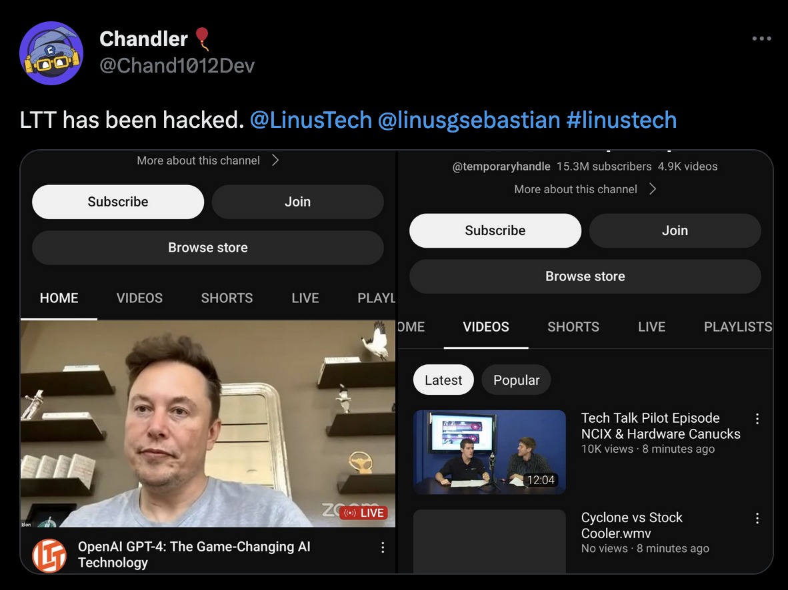

Let me get something out of the way: LTT getting hacked is what inspired me to write this. If you were not aware, Linus Tech Tips, one of YouTube biggest tech channels, was hacked.

They made a [video about the situation](https://youtu.be/yGXaAWbzl5A), but here is the TLDR: an employee received what they thought was a PDF from a legitimate sponsor for the channel. They downloaded the PDF, tried to open it, and when it didn’t open, went back to work. What the employee didn’t know is that the file they tried to open was actually malware, and embedded some code into their browser. That piece of malware took their session token from one of Google’s apps on their browser, and sent it to an attacker’s server. 

A session token is a unique identifier that is generated and assigned to a user's session when they log into a web application or service. This token is used to keep track of the user's session and to authenticate them for subsequent requests to the application or service.

Linus said that he will not be reprimanding the employee in any way because it was an honest mistake, which anyone could’ve made. So, what steps can you take to prevent something like this happening to you?

## Passwords & Managers

Use random 32 character passwords stored in a password manager. This may seem overkill to most people, but it is a crucial part of my SecOps, and even my accounts that don’t have a lot of risk attached to them (like my streaming accounts) have these types of passwords. There exists a type of attack called a dictionary attack, where hackers can use bots to guess a password based on dictionary words, and in some cases, use bots to scan social media accounts for potential hints as to what words your passwords or security questions count contain. 

Another concern some people have is why would they put all their passwords in one place? What if your password manager gets hacked?

While the idea of storing all of your passwords in one place may seem counterintuitive, using a reputable password manager can actually enhance your security. Password managers generate and store unique, complex passwords for each of your accounts, eliminating the need for you to remember them all.

Furthermore, many password managers use advanced encryption techniques to protect your data, making it more secure than storing passwords in a text file or on a piece of paper. Additionally, many password managers offer two-factor or multi-factor authentication, providing an additional layer of security to protect against unauthorized access.

In the event that your password manager is compromised, it's important to have a strong, unique password for the master password that unlocks your password manager. This password should be kept secure and never reused for other accounts.

Examples of good password managers include (in no particular order):

* [Dashlane](https://www.dashlane.com/)
* [Bitwarden](https://bitwarden.com/)
* [NordPass](https://nordpass.com/)

LastPass got [hacked earlier this year](https://www.wired.com/story/lastpass-engineer-breach-security-roundup/) so maybe don’t use them.

## Multi Factor Authentication

I have colleagues and friends who are into tech who **hate** 2FA and MFA. They say its inconvenient and annoying, but I really disagree. I think its one of the better revolutions in security in recent years. 

For those who don’t know, 2FA (2-factor authentication) and MFA (multi-factor authentication) are methods used to verify the identity of a user who is attempting to access a system or account, in addition to a username and password. 2FA typically involves the use of a second factor, such as a code generated by a mobile app or a text message sent to a registered phone number. This provides an extra layer of security to protect against unauthorized access. MFA goes a step further and involves using multiple factors to authenticate the user's identity. This could include a combination of something the user knows (like a password), something they have (like a smartphone or hardware token), and something they are (like biometric data such as a fingerprint or facial recognition).

While this sounds inconvenient, in the modern age its a necessary evil. Why? Because if your accounts’ password(s) ever leak, the hackers don’t have access to your account. They need at least one additional code, key, fingerprint, or hardware key to get into your account. That doesn’t mean you should never change your password, but it does mean that if you get a (real) email saying that someone in a country that is not your own has attempted to log into your account, your account is still safe. You can take the proper mitigation steps (which is simply just changing your password). 

## Minimize Accounts

The more accounts you have, the more risk you have of your data leaking. Therefore, it's a good security practice to minimize the number of accounts you have. Only create accounts for services that you need and regularly use. Avoid creating accounts for services that you don't need or have never heard of.

Additionally, regularly review your accounts and close any that you no longer need or use. This reduces your exposure to potential attacks and helps to keep your personal data secure.

While it may be tempting to use Single Sign-On (SSO) accounts such as Google or Facebook to sign in to multiple services, it's important to keep in mind that these services only protect your password from being leaked.

This means that while using SSO accounts can simplify the login process, they don't provide any additional security beyond protecting your password. The company that provides the SSO service still has access to your personal data, including your name, email address, and potentially other sensitive information.

Therefore, it's important to be mindful of the data that you share with these companies and to take steps to protect your personal information. This includes regularly reviewing your privacy settings and being selective about the information that you share with these services.

## Don’t Use Passwords

The only thing more secure than a good password is no password at all. Many companies offer the ability to sign in using one time passwords. These are codes that are generated for a single login attempt and cannot be reused, which makes them more secure than traditional passwords. Some companies also offer biometric authentication, such as fingerprint or facial recognition, which can be a convenient and secure alternative to passwords.

In addition, consider using passwordless authentication methods, such as hardware tokens or smart cards. These devices generate a unique code that is used to authenticate your identity, without the need for a password.

While these methods may require some initial setup and may not be available for all services, they can provide an additional layer of security and convenience for accessing your accounts.

## Common Sense

Never assume someone is who they say they are. Phishing attacks, social engineering, and other types of scams rely on tricking people into believing that the attacker is someone they're not. They may use fake email addresses or websites that look legitimate, or they may try to convince you to provide sensitive information over the phone or through email.

To protect yourself against these types of attacks, be wary of unsolicited messages or phone calls, especially if they're asking for personal or sensitive information. If you're unsure whether a request is legitimate, do some research or contact the company or individual directly using a verified phone number or email address.

It's also important to keep your software and devices up to date with the latest security patches and updates. Many attacks take advantage of vulnerabilities in outdated software or operating systems, so keeping your devices updated can help to prevent these types of attacks.

## Conclusion

Taking a proactive approach to your online security is essential in today's digital landscape. By using strong, unique passwords and password managers, enabling multi-factor authentication, minimizing the number of accounts you create, considering passwordless authentication methods, and exercising common sense, you can significantly reduce the risk of unauthorized access to your accounts and protect your personal data. Remember, staying vigilant and informed about the latest security trends and best practices is the key to safeguarding your digital life. Don't underestimate the importance of online security, and always be proactive in taking steps to protect your sensitive information.
